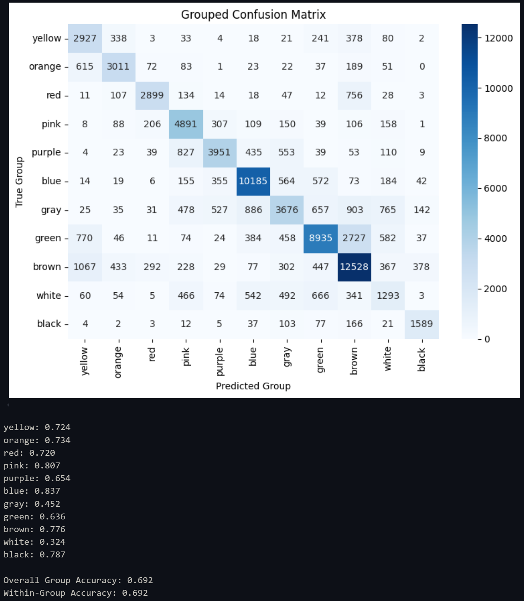

# YOLO Model evaluation

### Attempt 1

_First try_

```
imgsz=512
batch=4
patience=10
```

Learning stopped at 47 epochs \
mAP@50-95: 0.554 \
mAP@50: 0.630 \
mAP@75: 0.617

### Attempt 2

_Made imgsz bigger. Raised patience._

[`shape_yolo_v2.pt`](./models/shape_yolo_v2.pt)

```
epochs=500
imgsz=768
batch=4
patience=20
```

Learning stopped at 100 epochs \
mAP@50-95: 0.725 \
mAP@50: 0.795 \
mAP@75: 0.781

### Attempt 3

_Added generators that allowed for higher img and batch sizes._

```
TBD
```

# ResNet Model evaluation

### Attempt 1

_First try_

[`color_cnn_v1.pt`](./models/color_cnn_v1.pt)

```py
model.fc = nn.Sequential(
    nn.Linear(2048, 128),
    nn.ReLU(inplace=True),
    nn.Linear(128, len(color_classes)))

# Trained fot 70 epochs.
# patience = 20
# stopped manually
```

Overall Accuracy: 0.495



### Attempt 2

_Cleaned up data (found some wrong annotated photos). Modified the FC (raised Layer outputs to 512. added Batch Normalization and Dropout)._

```py
model.fc = nn.Sequential(
    nn.Linear(2048, 256),
    nn.BatchNorm1d(256),
    nn.ReLU(inplace=True),
    nn.Dropout(0.5),
    nn.Linear(256, len(color_classes)))
```
